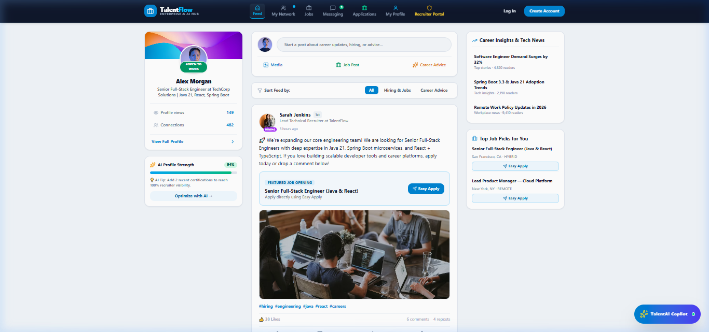
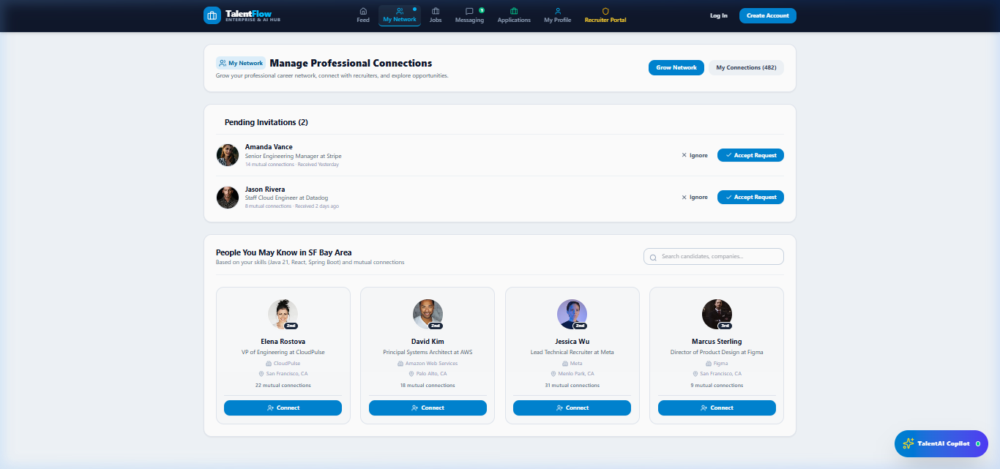
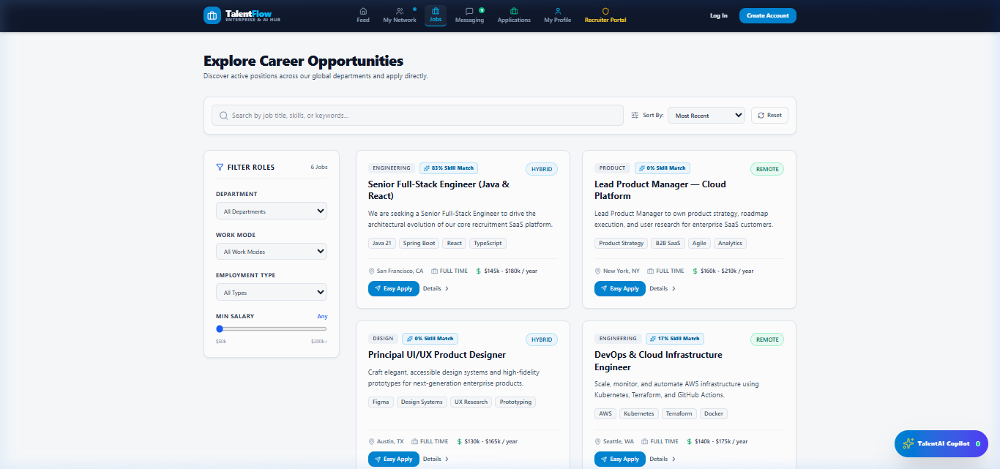
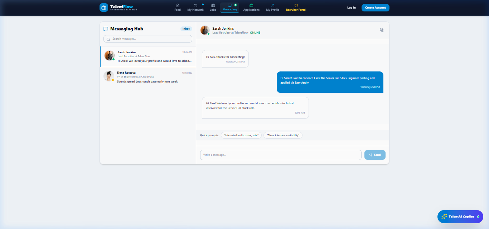
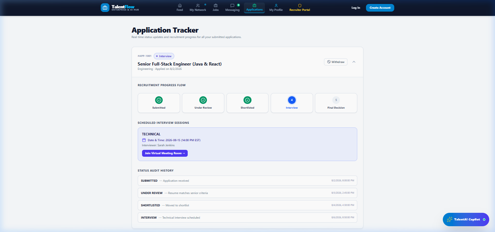
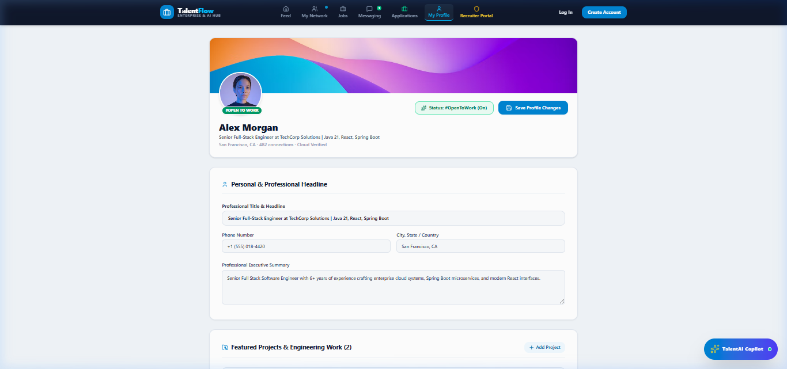
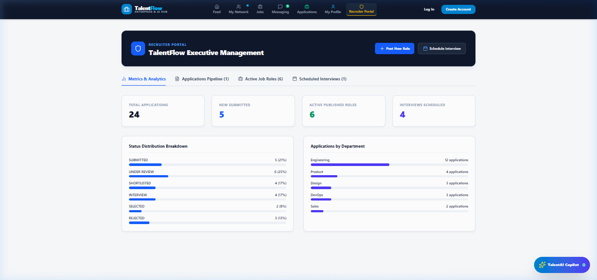

# 💼 TalentFlow — AI-Powered Enterprise Career & Talent Portal

> **TalentFlow** is a state-of-the-art, production-grade professional network and recruitment portal. Inspired by modern career platforms, TalentFlow combines a **Community Feed**, **1-Click Easy Apply**, **1-on-1 Direct Messaging**, **My Network Invitations**, **AWS S3 Cloud Storage**, **Full Profile Add/Remove Controls**, and **TalentAI Copilot (GPT-4o)** for AI-driven job matching, resume optimization, and interview preparation.

---

## 🎬 Platform Navigation Demo Video Walkthrough

> Live automated 7-step browser video recording cycling through **all 7 platform navigation routes** (Feed, My Network, Jobs, Messaging, Applications, Candidate Profile, and Recruiter Portal):

<div align="center">
  
  <p align="center" style="margin-top: 8px;">
    🎥 <strong>Video File Link</strong>: <a href="demo-navigation.webp">Play / Open demo-navigation.webp</a>
  </p>
</div>

---

## 📸 Captured Visual Results & Screenshots for All 7 Navigation Pages

Below are the full visual results captured for every navigation page in **TalentFlow**:

### 1. 🌐 Community Feed (`/feed`)


### 2. 👥 My Network (`/network`)


### 3. 💼 Jobs Board (`/jobs`)


### 4. 💬 Messaging Hub (`/messaging`)


### 5. 📂 Applications Tracker (`/candidate/applications`)


### 6. 👤 Candidate Profile Showcase (`/candidate/profile`)


### 7. 🛡️ Recruiter Portal Dashboard (`/admin`)


---

## 🌟 Comprehensive TalentFlow Feature Highlights

### 🤖 1. TalentAI Copilot Assistant (`AIChatBotWidget.tsx`)
- **Global AI Drawer**: Floating assistant accessible from every page with real-time AI prompts.
- **Job Match Calculator**: Calculates match score (e.g. 88% Match) and provides skill recommendations.
- **Interview Prep Engine**: Generates role-specific technical interview questions (Java 21, React, Spring Boot).
- **Salary Benchmarks**: Real-time compensation benchmarks for SF Bay Area & major tech hubs.
- **Resume Optimizer**: AI-generated executive summary recommendations.

### 🌐 2. Professional Community Feed (`FeedPage.tsx`)
- **Rich Post Creation**: Share text, images, job openings, and career advice.
- **Post Upvotes & Comments**: Real-time likes and expandable comment threads.
- **Featured Tagged Jobs**: Apply to tagged openings directly from feed posts.
- **AI Profile Strength Widget**: Live 94% profile completion tracker with actionable optimization tips.

### 👥 3. Network & 1-on-1 Messaging (`NetworkPage.tsx` & `MessagingPage.tsx`)
- **My Network Hub**: Accept or ignore pending connection invitations and discover recommended connections.
- **Real-Time Inbox**: 1-on-1 chat streams with online indicators, timestamps, and quick reply chips.

### ⚡ 4. 1-Click Easy Apply Modal (`EasyApplyModal.tsx`)
- Apply to jobs instantly with pre-filled profile details, auto-attached resume PDF, and TalentAI Skill Match score.

### 🛠️ 5. Advanced Profile & Full Add/Remove Controls (`CandidateProfilePage.tsx`)
Candidates have total control to **Add (+)** and **Remove (🗑️)** items across all 10 profile sections:
- 🛠️ **Featured Projects & Engineering Work** (+ Add / 🗑️ Remove)
- ☁️ **AWS S3 Cloud Storage Media Attachments** (+ Upload / 🗑️ Remove)
- 📜 **Licenses & Certifications** (+ Add / 🗑️ Remove)
- 📚 **Publications & Technical Papers** (+ Add / 🗑️ Remove)
- 🏆 **Honors & Awards** (+ Add / 🗑️ Remove)
- 📜 **Patents & Innovations** (+ Add / 🗑️ Remove)
- 🎓 **Education Background** (+ Add / 🗑️ Remove)
- 💼 **Work Experience** (+ Add / 🗑️ Remove)
- 🗣️ **Spoken Languages & Fluency** (+ Add / 🗑️ Remove)
- ⚡ **Technical Skills & Peer Endorsements** (+ Add / 🗑️ Remove)

---

## 🛠️ Technology Architecture

### Frontend
- **Framework**: React 18 + TypeScript + Vite
- **Styling**: Tailwind CSS v4 + Vanilla CSS Design Tokens
- **Icons**: Lucide React
- **Routing**: React Router v6
- **HTTP Client**: Axios (with Try/Catch resilience & S3 Cloud Fallbacks)

### Backend
- **Framework**: Java 17 + Spring Boot 3
- **Security**: Spring Security + Stateless JWT
- **ORM**: Spring Data JPA + Hibernate
- **Database**: MySQL 8.0

---

## 🐳 Docker Cloud Production Deployment

Deploy the entire full-stack application (Frontend + Backend + MySQL) with a single command:

```bash
docker-compose up --build
```

Access the deployed application at:
- **Frontend App**: `http://localhost:80`
- **Backend API**: `http://localhost:8080/api`

---

## 🗃️ Seeded Test Accounts

| Role | Email | Password |
| :--- | :--- | :--- |
| **Admin / Recruiter** | `admin@talentflow.com` | `Admin@123` |
| **Candidate** | `candidate@talentflow.com` | `Candidate@123` |

---

## 🚀 Local Development

```bash
# Start Frontend
cd frontend
npm install
npm run dev
```

Visit `http://localhost:5173` to launch **TalentFlow**.
