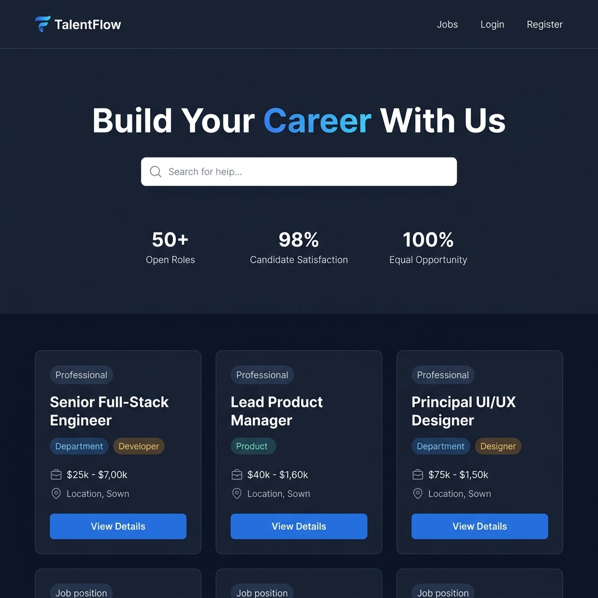

# 💼 TalentFlow — Enterprise Career & Job Application Portal

> A production-quality, full-stack **enterprise recruitment platform** built with React + TypeScript + Tailwind CSS (frontend) and Java Spring Boot + Spring Security + MySQL (backend). Features JWT authentication, multi-step application forms, a real-time admin recruiter dashboard, candidate profile management, and role-based access control.

---

## 📸 Interface Preview & 10-Second Navigation Walkthrough



> [!NOTE]
> Below is the full 10-second interactive navigation recording of the TalentFlow career portal:


---

## 🌟 Key Features

* **JWT-Secured Authentication**: Role-based login for Admin, Recruiter, and Candidate with BCrypt password hashing and stateless JWT tokens.
* **Job Listings & Search**:
  * Browse and filter open positions by keyword, department, location, employment type, and work mode (Remote / Hybrid / On-site).
  * Detailed job pages with salary range, responsibilities, requirements, and screening questions.
* **Multi-Step Application Flow**:
  * Step 1 — Personal Info · Step 2 — Resume Upload · Step 3 — Cover Note · Step 4 — Screening Questions · Step 5 — Review & Submit.
  * Real-time progress bar and form validation using React Hook Form + Zod.
* **Candidate Dashboard & Profile**:
  * Full profile editor with work experience, education, skills, LinkedIn/GitHub/portfolio links, and resume upload.
  * Application tracker with full status timeline history (Submitted → Under Review → Shortlisted → Interview → Selected / Rejected).
* **Admin / Recruiter Dashboard**:
  * Live stats: total jobs, active roles, total applications, scheduled interviews, selected candidates.
  * Application pipeline with tab filters by status, recruiter private notes, and one-click status updates.
  * Job management: create, edit, publish, and close job postings with custom screening questions.
* **Notification System**: In-app notification bell with unread count and status-change alerts for candidates.
* **Fully Responsive**: Clean, corporate slate/navy design system optimised for desktop, tablet, and mobile.

---

## 🛠️ Technology Stack

### Frontend
* **Framework**: React 18 + TypeScript + Vite
* **Styling**: Tailwind CSS v4
* **Routing**: React Router v6
* **HTTP Client**: Axios (with JWT interceptor)
* **Form Validation**: React Hook Form + Zod
* **Animations**: Framer Motion
* **Icons**: Lucide React

### Backend
* **Language & Framework**: Java 17 + Spring Boot 3
* **Security**: Spring Security + JWT (stateless)
* **ORM**: Spring Data JPA + Hibernate
* **Database**: MySQL 8.0
* **Build Tool**: Apache Maven

---

## 🗃️ Seeded Test Accounts

| Role | Email | Password |
| :--- | :--- | :--- |
| **Admin** | `admin@talentflow.com` | `Admin@123` |
| **Recruiter** | `recruiter@talentflow.com` | `Recruiter@123` |
| **Candidate** | `candidate@talentflow.com` | `Candidate@123` |

---

## 🚀 Quick Start & Local Run

### Prerequisites
* Java 17+, Apache Maven 3.6+
* Node.js 18+, npm
* MySQL 8.0 running on port `3306`

### 1 — Start the Backend

```bash
cd career-portal/backend
mvn spring-boot:run
```

Backend API available at: `http://localhost:8080/api`

### 2 — Start the Frontend

```bash
cd career-portal/frontend
npm install
npm run dev
```

Open your browser and visit: `http://localhost:5173`
